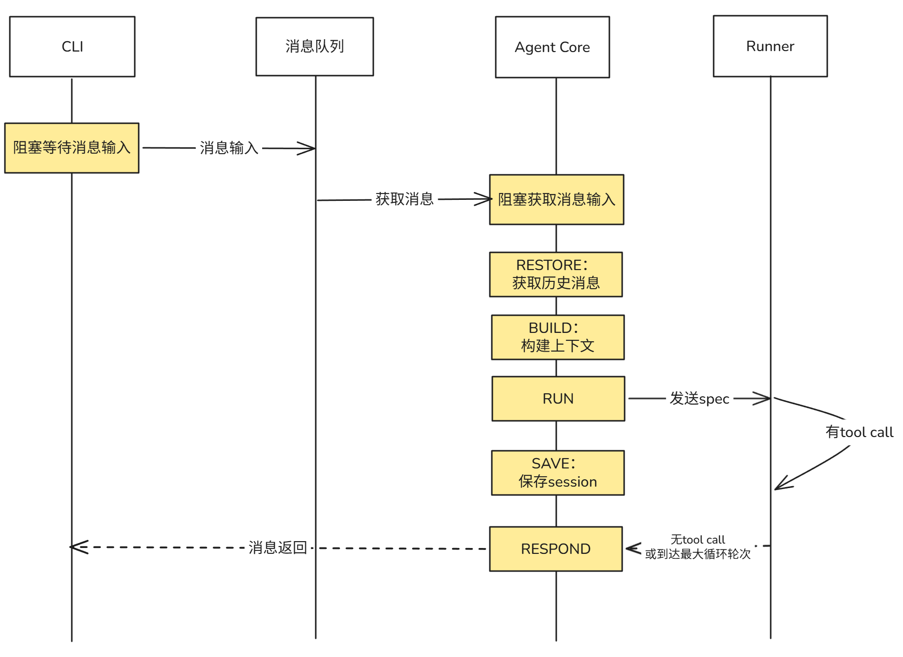

# Agent的本质

Agent在本质上只是一个配备了上下文管理和工具调用的循环会话，每次接收输入与工具定义，然后进入agent loop，如果某一轮循环不再有工具调用要求，认为可以输出最终结果，于是将这一轮的结果输出到聊天窗口。

# 基础框架
因此，一个基础的agent只需要以下组件，组成一个线性流程：
1. 输入输出接口
2. agent loop
3. 模型调用api

为了后续开发与维护的遍历，参考[nanobot](https://github.com/HKUDS/nanobot)额外搭建状态机驱动的agent loop，这个模式的好处是：
- 每个状态可以独立测试
- 可以插钩子
- 状态转移是查表的，一眼能看完整条链

所以最终的基础框架构成是：
1. provider：用来抽象 llm 的 api 接口，负责收消息列表 + 工具定义，调远程 API，返回响应。
2. runner：agent runner，核心循环，负责与 llm 的循环交互，解析 tool call，调用工具，拼接结果上下文再传回 llm。
3. core：状态机驱动的agent loop，包含 RESTORE -- 恢复会话，BUILD -- 构建上下文，RUN -- 激活核心循环，SAVE -- 保存会话，RESPOND -- 组装回复消息。

# 运行
```txt
┌──────────────────────────────────────────────────┐
│  while True:                                     │
│    读取用户输入                                   │
│    ├─ 如果输入是 /exit 或 quit → break            │
│    ├─ 如果输入是空行 → continue                   │
│    └─ 否则 → 构建 InboundMessage                  │
│                                                   │
│    传给 AgentCore.process_message()               │
│    │   ├─ RESTORE → BUILD → RUN → SAVE → RESPOND  │
│    │   └─ session 自动累积历史消息                 │
│                                                   │
│    打印 LLM 的回复                                 │
└───────────────────────────────────────────────────┘
```

# ReAct 基本流程


# 参考资料
1. 开源项目[nanobot](https://github.com/HKUDS/nanobot)
